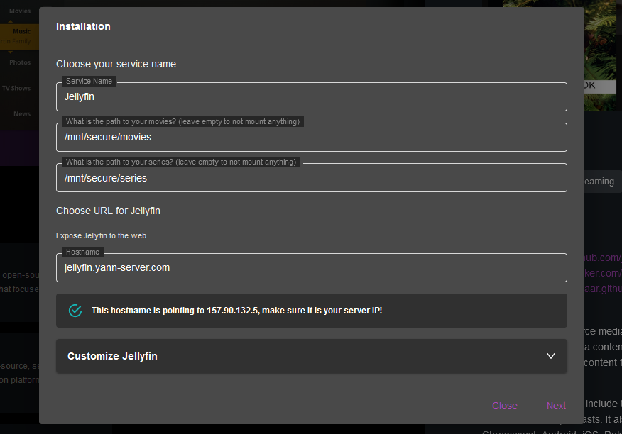

# Cosmos Market

The cosmos market is a place for you to find pre-configured cosmos-compose files that you can install on your servers. Most applications can be installed as-is directly from the market. The installation will cater for setting up container (or containers, if it needs a DB for example), networks, volumes, links, and even reverse-proxy routes.

## How to use the market

First select the market tab on the left.

Here you can see the highlighted applications on the top, and the available applications on the bottom. By clicking one application you will be directed toward the application page.

Here on the right you will see details about the application: 

* The name
* The tags
* the supported CPUs and architectures
* the repository link, docker hub link, and compose file link
* The description
* The install button

## Review the application

You can easily review what sources Cosmos is using to install the applications

* The repository link will take you to the repository where the application is hosted. You can review the code, the compose file, and the dockerfile.
* The docker hub link will take you to the docker hub page of the application. You can review the dockerfile, the tags, and the docker hub description.
* The compose file link will take you to the compose file that Cosmos will use to install the application. You can review the compose file and make sure it is safe to use.

More details about cosmos-compose files can be found [here](/doc/7 Cosmos-compose/).

## Install the application

Once you are satisfied with the application, you can click the install button. This will take you to the installation page.

This form will allow you to configure the application before installing it. You can change the name, the network, the volumes, the ports, and the environment variables.

The top part of the installation is the installation form, those are parameters that the cosmos-compose file is asking for. Usually the most important part are going to be the file paths, as those will usually create binds to those paths for your containers.

After the form, each container as an advanced customization panel that you can expand to review the details of your installation. You can review and customize the volumes, the labels and the environment variables. Note that any change made in this panel will be overwritten if you change the form above again.

Before clicking install, make sure you are happy with the configured hostname, and that this hostname exist in your DNS entries!

## Post-installation

After the install is done, your application will be ready to use. Note that some application can provide a few extra step or informations after the install, please make sure you read and follow them carefully!

For example a container might ask you to setup something in them, or they might give you the admin password of your application. If you didn't see those, they usually appear in the env var of your container (see the servapp page), so no worry!

Finally Cosmos will ask you to restart if it added any new routes to your reverse-proxy. You can do that by clicking the restart button on the top right of the popup.