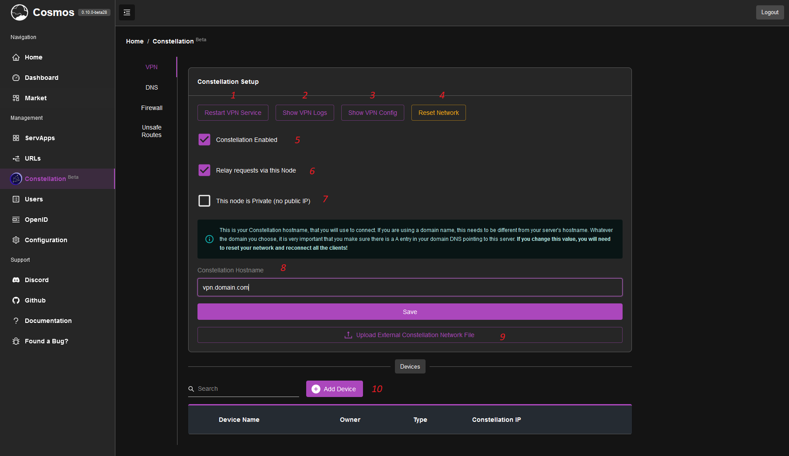
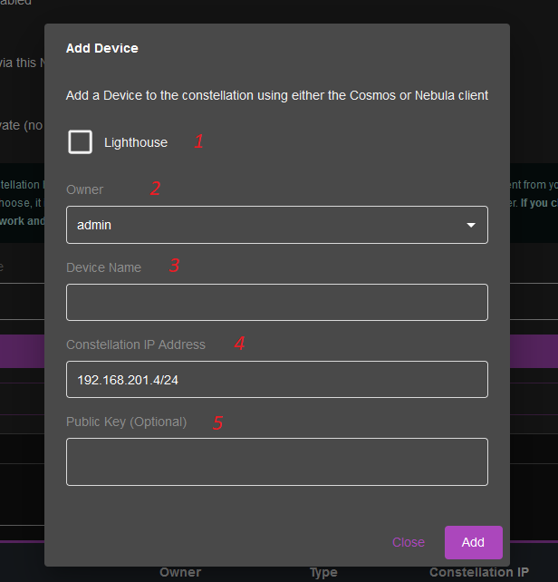

# Constellation VPN

## Introduction

Constellation is a VPN module that allow you to remotely connect to your server. It is based on Nebula, and is a very powerful tool to secure your server. Typically, you would have to open/forward ports to your servers to connect to it remotely. With Constellation, you can connect to your server without opening any ports, and without any risk of being hacked. It is also very easy to setup, and can be used to connect to multiple servers at once.

## Interface 

When going to the Constellation page, you first need to enable the VPN. Once done, you should see this:

Here's a breakdown:

1. This allows you to restart the internal VPN service (Nebula). This is useful when you change the config, or if the VPN is not working properly.
2. The logs of the service, for debugging purposes
3. Output the config used by the VPN, also useful for debugging
4. Completely destroys your network. If you plan on doing significant work, you can start anew
5. Enable / Disable the network
6. This allows this server to relay request. By default Constellation will try to establish P2P connections between different nodes of our Constellation. Sometime, this is not possible, for example if you are behind certain types of NAT. In this case, you can enable this option, and the server will relay the request for you. This will increase latency, but will allow you to connect to your nodes.
7. Make the server private. By default it is "public": it means that Constellation will assume that the IP/hostname of this server is accessible from the internet. If that's not the case (for example a home server behind CGNAT) then you can enable this option (see later on how to create a public node).
8. This is the hostname to your network. **Do not forget to add a DNS A entry for it in your domain**
9. In case this is not your main server (either a public server or just a side server), you can connect it to another Cosmos' Constellation network by uploading the constellation.yml file there
10. This is the list of nodes/devices in your network. You can add nodes by clicking on the "Add Node" button. You can also remove nodes by clicking on the "Remove" button.

## Create a Device

In order to connect to your network, you need to create a device. To do so, click on the "Add Node" button. You should see this:

1. This allows you to choose whether the new device is a lighthouse or not. See the next section for more info about lighthouses. If you select it, you will be able to set the hostname of the lighthouse and whether or not it can relay request (see above).
2. The owner of the device, useful for permissions and management
3. The name of the device
4. The IP of the device. By default it will automatically select the next available IP in the network. You can change it if you want, but make sure it is not already taken.
5. (Optional) The public key of the device. You probably don't need to change it, but if you want to use a specific key, you can do so. That option was only added because of the Nebula mobile app, which requires a specific key to work.

Once you are done, click on "Add" and your device will be able to connect. You will see a screen with a QR Code and a file to download. You can use either of them to connect to your network.
It is advisable to use the QR Code on your mobile and the file on your computer.

## Client

In order to connect to your network, you need to download the client. You can do so by clicking on the "Download" button. You can find the applications for your platform [here](https://cosmos-cloud.io/clients)

## Lighthouses and Relaying

Constellation uses a P2P protocol to connect to your devices. This means that your devices will try to connect to each other directly. However, this is not always possible. For example, if you are behind a CGNAT, you will not be able to connect to your devices. In this case, you can use a lighthouse. A lighthouse is a device that is publicly accessible, and that will relay the request for you. You can think of it as some kind of "guide" for your requests.

By default the traffic will not go through the lighthouse, but if the direct connection fails, it will relay the traffic, assuming you enabled the relay option.

## CGNAT and various multi-server setups

The power of this technology lies in its Mesh VPN capabilities. Even if your main server at home is behind a CGNAT, you can still connect to it from anywhere in the world. You can also connect multiple servers together, and they will be able to communicate with each other. For example, you can have a server at home, and a server in the cloud, and they will be able to communicate with each other in a secured, encrypted tunnel. 

In order to achieve this: 
* Create a Constellation network in your main server
* Create a lighthouse type of device
* Download the config file, and upload it to your secondary server
* Add devices on your main server to connect

A simple $5 DigitalOcean droplet can be used as a lighthouse, and you can connect to your home server from anywhere securely. **It is also important as of 0.10 that you create the lighthouses before connecting the clients** (this will be further improved in the future).

Do not use a firewall to isolate the private server completely, as it will block even the traffic that "respond" to outbound traffic. Instead, use the firewall to block inbound traffic on your public IP, for all port except 4242.

## Gateway proxies

Additionally to being a lighthouse, your public server can be used as a gateway to your private assets. Either a secured gateway (within Constellation) or a gateway accepting outside connection. In order to do so, please refer to the [URLs](#urls) section, the part about chaining proxies.

## Securing your containers

One appeal of Constellation is the integration to the reverse proxy and the ability to secure your URLs.

Doing so is extremely easy. In your URL management screen, an option called "Restrict to Constellation network" is available. If you enable it, then only devices connected to your network will be able to access this URL. This is useful to expose private URLs to your network.

## DNS and Constellation

Constellation has its own internal DNS server. This means that you can use Constellation as an alternative to PiHole and Adguard. You can add ads block lists, and also add your own custom DNS records. This is useful to expose private URLs to your network.

The Constellation private DNS is also integrated to your reverse proxy: Whenever you connect to your constellation, it will overwrite all your URL to use your constellation IPs instead of your public IP. This way, all your connections will be secured through your VPN tunnel.

You can setup your DNS entries in the DNS tab of the constellation page.

## P2P and Meshing

Since Constellation is a P2P meshing VPN, it also means that your devices can connect to each other directly. This is useful if you want for example to share some samba shares between your devices, or even play LAN games. Always remember to use the Constellation IP of your devices when doing so, in order for the connection to work.