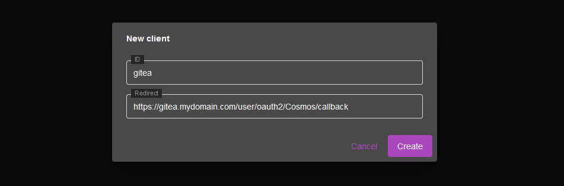
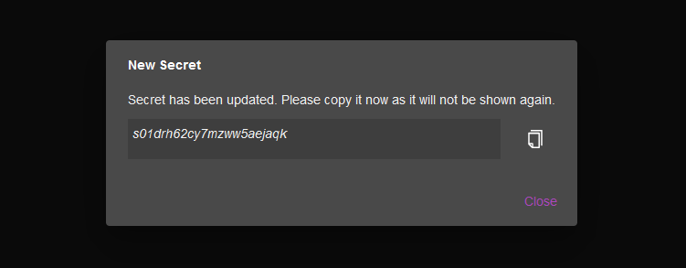
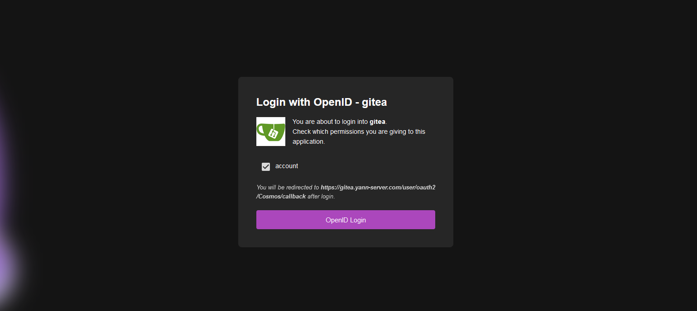
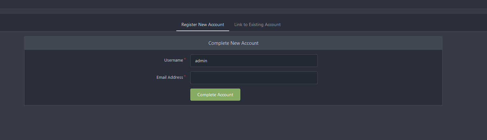
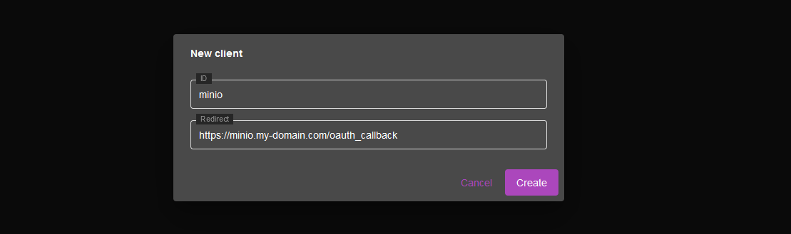
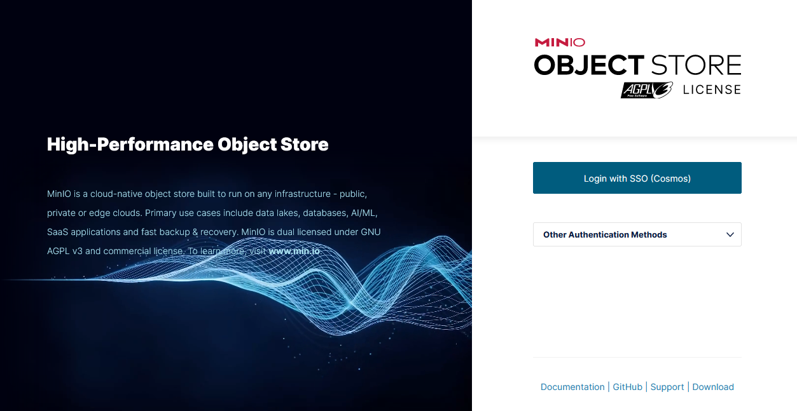
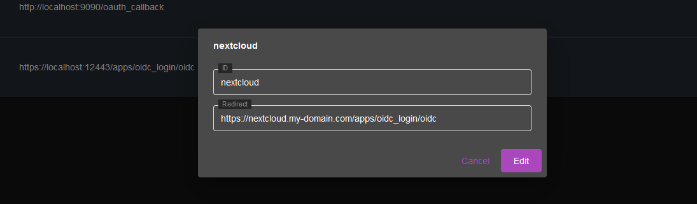
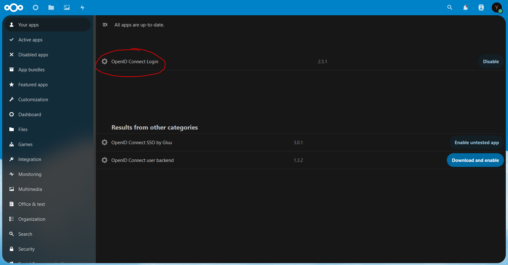
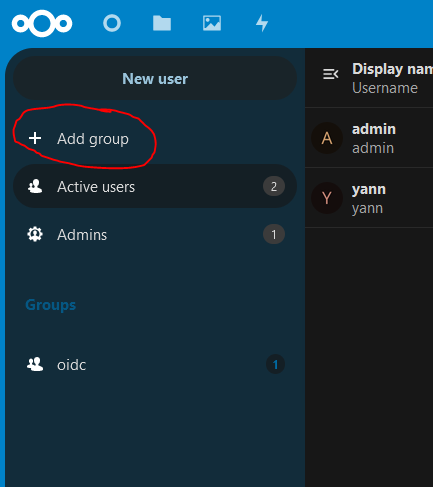
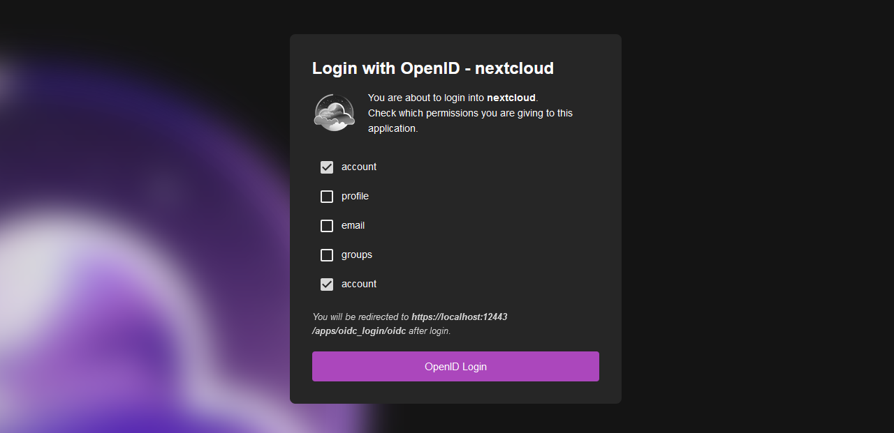

## Introduction

Cosmos supports OAuth 2.0 and OpenID to authenticate users. This allows your installed servapps to login users using your Cosmos account. This is a great way to centralize your user management and to avoid having to create a new account for each servapp.

## Setup

There are two steps to setup OpenID:

1. Setup the OpenID provider: In the Cosmos UI, go to the OpenID submenu and create a client
2. Setup the servapps: Depends greatly on the app. See below for more details with common apps


## Gitea

This is an example configuration that will work to setup Gitea with Cosmos OpenID.
This guide assumes you have gitea up and running on the subdomain gitea.my-domain.com

### Step 1: Create the Gitea client

First, visit the OpenID tab, and click create.


Then, fill in the form:



The infos are:
 
 * ClientID: gitea
 * Redirect: https://gitea.my-domain.com/user/oauth2/Cosmos/callback

### Step 2: Create Secret

 Press the "Reset Secret" button to generate a secret. Copy the secret somewhere safe, you will need it later.

 

 
### Step 3: Setup Gitea

 Assuming you already created the main Admin account, login and access the admin panel.

 

 Then, go to the "Authentication Sources" tab

 

 and fill in the form:


The infos are:

 * Authentication Type: Oauth2
 * Authentication Name (don't forget the capital case) : Cosmos 
 * OAuth2 Provider: OpenID Connect
 * Client ID: gitea
 * Client Secret: the secret you copied earlier
 * Icon URL: https://my-domain.com/logo
 * OpenID Connect Auto Discovery URL: https://mydomain.com/.well-known/openid-configuration

 You can ignore the rest and press "Add Authentication Source" at the bottom of the page

### Try to login

 Open a private navigation window and go to https://gitea.my-domain.com/user/login you will be prompted with the following screen:


Notice the "Login wth Cosmos" button. Click it and you will be redirected to the Cosmos login page. Enter your Cosmos credentials and then you will see a page asking you to confirm the permissions you are giving to Gitea. Since we are not asking for any special permissions, you can just press "Login" and you will be redirected back to Gitea and logged in.



Gitea for the first login will ask you to setup the account associated with your Cosmos account. You can choose to use the same username as your Cosmos account or a different one. You can also choose to use the same email as your Cosmos account or a different one. Once you are done, you will be logged in and you can start using Gitea.



Don't worry it will only ask on the first login. If you want to change the username or email later, you can do so from the Gitea settings page.


## Minio

This is an example configuration that will work to setup Minio with Cosmos OpenID.
This guide assumes you have minio up and running on the subdomain minio.my-domain.com

### Step 1: Create the Minio client

First, visit the OpenID tab, and click create.


Then, fill in the form:



The infos are:
 
 * ClientID: minio
 * Redirect: https://minio.my-domain.com/oauth_callback

### Step 2: Create Secret

 Press the "Reset Secret" button to generate a secret. Copy the secret somewhere safe, you will need it later.

 
 
### Step 3: Setup Minio

 Assuming you already created the main Admin account, login and access the admin panel.
 Then, go to the "Identity Providers" tab, and "create configuration"

 

 and fill in the form:


Be careful! Minio uses a policy system which dictates what a user can do (think of it as a permission table). you have 3 different modes of function to choose from:

 * Per group policy: **recommended** if you want to use admin and user groups policy
 * Per user policy: If you want to setup a different policy for each user
 * Single policy: If you want to use a single policy for all users (everyone admin or everyone read-only for example)


The infos are:

 * Config URL: https://my-domain.com/.well-known/openid-configuration
 * Client ID: minio
 * Client Secret: the secret you copied earlier
 * Redirect URL: https://minio.my-domain.com/oauth_callback

And then depending on the mode you chose.

For per-group policy:
 * Claim Name: role
 * Claim User Infos: true

For per-user policy:
 * Claim Name: sub
 * Claim User Infos: false

For global policy:
 * Claim Name: leave it empty
 * Claim User Infos: false
 * Role Policy: policy name you want (ex: readonly)

You can ignore the rest and press "Save" at the bottom of the page. Minio will ask you to restart the server, do so.

### Step 4: Create a policy for a user or a group

If in the previous screen you selected per-user or per-group policy, we need to create a policy for each user or group. If you selected global policy, you can skip this step.

Let say that we have a user named "bob" and that we want to grant them write rights on Minio. We will need to create a policy for them, with the name "bob". If you want to create a group policy instead (if you selected that option previously) you need to create two policies : user, and admin.

First, head to the policy screen, and click "Create Policy"


Then, fill in the form:


If you are creating a user policy, type their username in the name field, if you are creating a group policy, type "user" or "admin".

Select which policy you want to apply for each users and groups and create them one by one. Please note once again, if you are using per-group policy you need to create **admin** and **user** policies.

The policy to apply for read only rights is:

```json
{
    "Version": "2012-10-17",
    "Statement": [
        {
            "Effect": "Allow",
            "Action": [
                "s3:GetBucketLocation",
                "s3:GetObject"
            ],
            "Resource": [
                "arn:aws:s3:::*"
            ]
        }
    ]
}
```

The policy to apply for Read/Write rights is :

```json
{
    "Version": "2012-10-17",
    "Statement": [
        {
            "Effect": "Allow",
            "Action": [
                "s3:PutObject"
            ],
            "Resource": [
                "arn:aws:s3:::*"
            ]
        }
    ]
}
```

And for full admin rights: 

```json
{
    "Version": "2012-10-17",
    "Statement": [
        {
            "Effect": "Allow",
            "Action": [
                "admin:*"
            ]
        },
        {
            "Effect": "Allow",
            "Action": [
                "kms:*"
            ]
        },
        {
            "Effect": "Allow",
            "Action": [
                "s3:*"
            ],
            "Resource": [
                "arn:aws:s3:::*"
            ]
        }
    ]
}
```

### Try to login

Open a private navigation window and go to https://minio.my-domain.com/minio/login you will be prompted with the following screen:



Simply click on login with Cosmos and after login, you will see a screen asking you to confirm the permissions you are giving to Minio. Minio does ask a few things but we only really need to grant it the "email" permission. Everything else is currently ignored by Cosmos.


Once you are done, you will be logged in and you can start using Minio.

## Nextcloud

This is an example configuration that will work to setup Nextcloud with Cosmos OpenID.
This guide assumes you have Nextcloud up and running on the subdomain nextcloud.my-domain.com

### Step 1: Create the Nextcloud client

First, visit the OpenID tab, and click create.


Then, fill in the form:



The infos are:
 
 * ClientID: nextcloud
 * Redirect: https://nextcloud.my-domain.com/apps/oidc_login/oidc

### Step 2: Create Secret

Press the "Reset Secret" button to generate a secret. Copy the secret somewhere safe, you will need it later.


### Step 3: Setup Nextcloud

Assuming you already created the main Admin account, login and access the admin panel.
Go too "Apps" and install the app called "OpenID Connect Login".



Then, open your config.php file, in /config/www/nextcloud/config/config.php in your Nextcloud container.

Add the following to the file, inside the array (before the closing parenthesis and semicolon)

```php
    'overwriteprotocol' => 'https',
    'oidc_login_provider_url' => 'https://my-domain.com',
    'oidc_login_client_id' => 'nextcloud',
    'oidc_login_client_secret' => 'THE SECRET YOU COPIED EARLIER',
    'oidc_login_auto_redirect' => false,
    'oidc_login_end_session_redirect' => false,
    'oidc_login_button_text' => 'Log in with Cosmos',
    'oidc_login_hide_password_form' => false,
    'oidc_login_use_id_token' => true,
    'oidc_login_attributes' => array (
        'id' => 'sub',
        'name' => 'sub',
    ),
    'oidc_login_default_group' => 'oidc',
    'oidc_login_use_external_storage' => false,
    'oidc_login_scope' => 'openid profile email groups',
    'oidc_login_proxy_ldap' => false,
    'oidc_login_disable_registration' => false,
    'oidc_login_redir_fallback' => false,
    'oidc_login_alt_login_page' => 'assets/login.php',
    'oidc_login_tls_verify' => true,
    'oidc_create_groups' => false,
    'oidc_login_webdav_enabled' => false,
    'oidc_login_password_authentication' => false,
    'oidc_login_public_key_caching_time' => 6400,
    'oidc_login_min_time_between_jwks_requests' => 10,
    'oidc_login_well_known_caching_time' => 6400,
    'oidc_login_update_avatar' => false,
```

Note that there is a "oidc_login_default_group" which is set to "oidc". This is the group that will be assigned to users that login with Cosmos. You can change this to whatever you want, but you will need to create the group in Nextcloud first.

### Step 4: Create the group

Go to the admin panel, and click on "Groups" then click on "Add group" and type "oidc" in the name field. If you selected another group name, use that instead. If you are using a group you already created before, you can skip this step.



### Try to login

Open a private navigation window and go to https://nextcloud.my-domain.com you will be prompted with the following screen:



Simply click on login with Cosmos and after login, you will see a screen asking you to confirm the permissions you are giving to Nextcloud. Nextcloud does ask a few things but they are actually not used in Cosmos so it does not matter what you pick here. simply Login and you will be redirected to Nextcloud logged in.