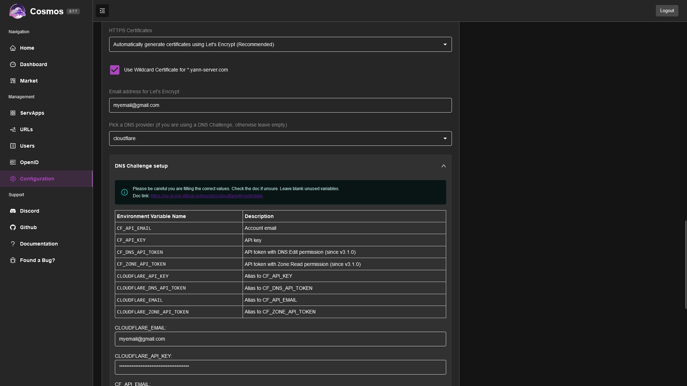
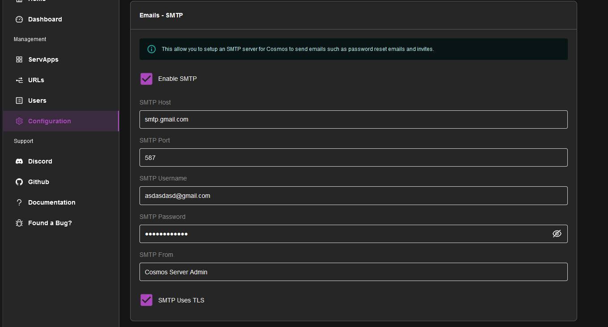
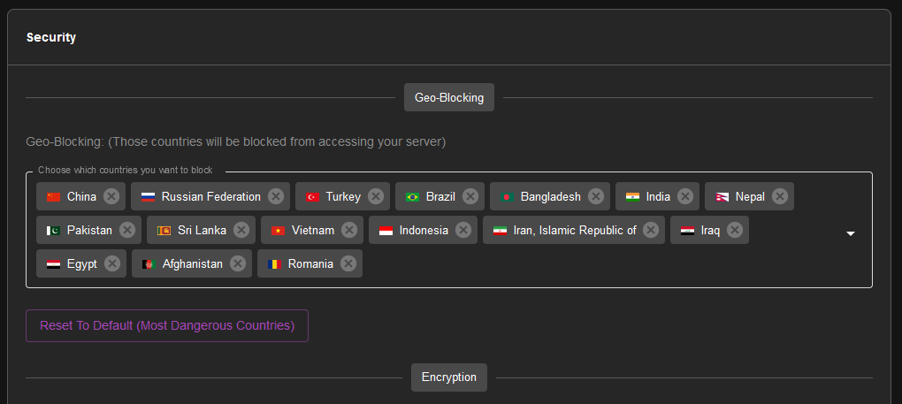

## DNS Challenge and wildcard certificates

In order to setup the DNS challenge with Cosmos we have 3 steps to follow:

 - First, make sure your hostname is your main domain name
 - Second, set "DNS Provider" to your DNS provider key in the config page (see [here](https://go-acme.github.io/lego/dns/) for the list of supported providers)
 - Finally, setup the variables for your DNS provider. Note that you do **not** need to setup LEGO/Certbot manually as it is included, and you do **not** need actual environment variables like with vanilla LEGO, you can simply provide the keys and tokens in the config page form:



Small warning about cloudflare DNS, there are a lot of different values, but you do not need all of them. You also need to be careful to use an API key in the KEY field OR a token in the TOKEN field. If you exchange them, you will see and error. Refer to the docs for more info.

Once setup, it will automatically renew your certificates every 90 days.

For  the DNS Challenge to work, you need to use wildcards certificates, check the box "Wildcard Certificate" and make sure your DNS provider supports it.

**Remember your cosmos hostname needs to be "mydomain.com"** and not "www.mydomain.com" for example, for the wildcard certificate to work. Cosmos will automatically request "*.mydomain.com" and any additional domains you have setup.

## Emails

Cosmos can send emails to users. To do so, you need to setup an SMTP server. You can use your own SMTP server, or use a third party service like [Mailgun](https://www.mailgun.com/) or [Gmail](https://www.google.com/gmail/).

The setup is simple in the config:



please note that Gmail will require you to create an [App Password](https://support.google.com/accounts/answer/185833?hl=en) to use SMTP.

## Geo-Blocking

Cosmos can block users from specific countries. You can setup the list of blocked countries in the config:



## IPV6

In order for Cosmos to work properly on a server using IPV6, you need to tell Docker to use IPV6. To do so, you need to edit the file `/etc/docker/daemon.json` and add the following:

```json
{
  "ipv6": true,
  "fixed-cidr-v6": "2001:db8:1::/64"
}
```

In the "fixed-cidr-v6" field, replace "2001:db8:1::/64" with your IPv6 network range.

Restart the daemon to apply changes.

## Env Var

You can set environment variables in the config. This is useful if you want to use a different port or database name. You can use the following variables:

* COSMOS_HTTP_PORT: the port number that the Cosmos server should listen on for HTTP connections.

* COSMOS_HTTPS_PORT: the port number that the Cosmos server should listen on for HTTPS connections. 

* COSMOS_HOSTNAME: the hostname or IP address that the Cosmos server should use

* COSMOS_HTTPS_MODE: specifies how the Cosmos server should handle HTTPS certificates. Valid values are "SELFSIGNED" (generate a self-signed certificate), "LETSENCRYPT" (obtain a certificate from Let's Encrypt), or "PROVIDED" (use a custom certificate) or "DISABLED" for no HTTPS.

* COSMOS_GENERATE_MISSING_AUTH_CERT: a boolean flag that determines whether the Cosmos server should automatically generate an authentication certificate if one is missing.

* COSMOS_TLS_CERT: the TLS certificate to use for HTTPS connections.

* COSMOS_TLS_KEY: the TLS private key to use for HTTPS connections.

* COSMOS_AUTH_PRIV_KEY: the path to the private key file used for authentication.

* COSMOS_AUTH_PUBLIC_KEY: the path to the public key file used for authentication.

* COSMOS_LOG_LEVEL: the logging level for the Cosmos server. Valid values are "DEBUG", "INFO", "WARNING", and "ERROR".

* COSMOS_MONGODB: the connection string for the MongoDB database that the Cosmos server should use.

* COSMOS_SERVER_COUNTRY: the two-letter country code that the Cosmos server is located in. This is for whitelisting your country when you are from a country that is blocked by default.

## SE Linux

If you are using SE Linux, you need to allow the container to access the docker socket. To do so, make sure you run the container as privileged. See details on the [Index Page](../../guides/setup/#step-1-docker/).

## Details about the mounts

* `/var/run/docker.sock:/var/run/docker.sock`: This is the docker socket, it is needed for Cosmos to be able to manage your containers. If you do not provide it, Cosmos can work in Proxy-only  mode, but won't be able to manage your containers, as well as disabling multiple other quality of life features.

* `/var/lib/cosmos:/config`: This is where Cosmos will store its config file. It is recommended to mount it to a folder on your host, so you can easily backup your config file. If you do not provide it, Cosmos will use a volume instead, which is not easily accessible.

* `/:/mnt/host`: This is where Cosmos will mount your host filesystem. It is needed to create folder on your host when importing docker-compose files. Without this, Cosmos will only be able to create folders inside the container, which won't be enough for you in most cases, letting you creating folders manually on your host. Note that it is not a security issue to provide this additional mount since with the docker socket, Cosmos can already mount anything it wants on your host.

In case you are wondering if providing the docker socket is a security issue, the answer is no: 

* Cosmos is a supervisor. While most supervisor run as root on the host directly (ex. Unraid, CasaOS, ...), Cosmos runs inside a container, offering better security than most alternatives. While other supervisor also run as a container (ex. Portainer, Yatch, ...), they still require access to the docker.sock to be able to manage your containers just like Cosmos does.

* Sources are available, and you can check the code yourself.

* While it is NOT a security issue, it still means that any vulnerabilities would have greater importance. This is why as an actively maintained project, any vulnerabilities discovered would be patched right away.

**While it's impossible to claim absolute zero risk, the security benefits of running Cosmos as supervisor are in any case far greater than any hypothetical risk.**