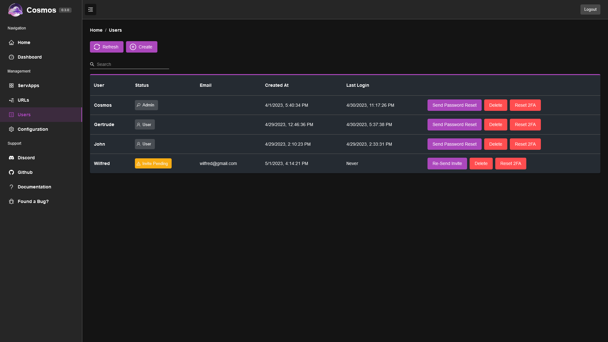

This is a simple user management screen. You can create new users, and edit existing ones.

If you click on a row, a modal allow you to change the email address of the user, it is the email used to send invites and password reset.

If you create a new user, it will either send an invite directly to them, or simply display an invite link that you can send to them. If you do not have emails setup, please copy and send the link manually. If you forgot to copy it, you can generate a new one with the button "re-send invite". this button is also useful if the user lost the invite link, or it expired.

You can also generate password reset links for existing users, in case you haven't setup emails yet.

Finally you can delete a user or reset their 2FA if they lost their device.